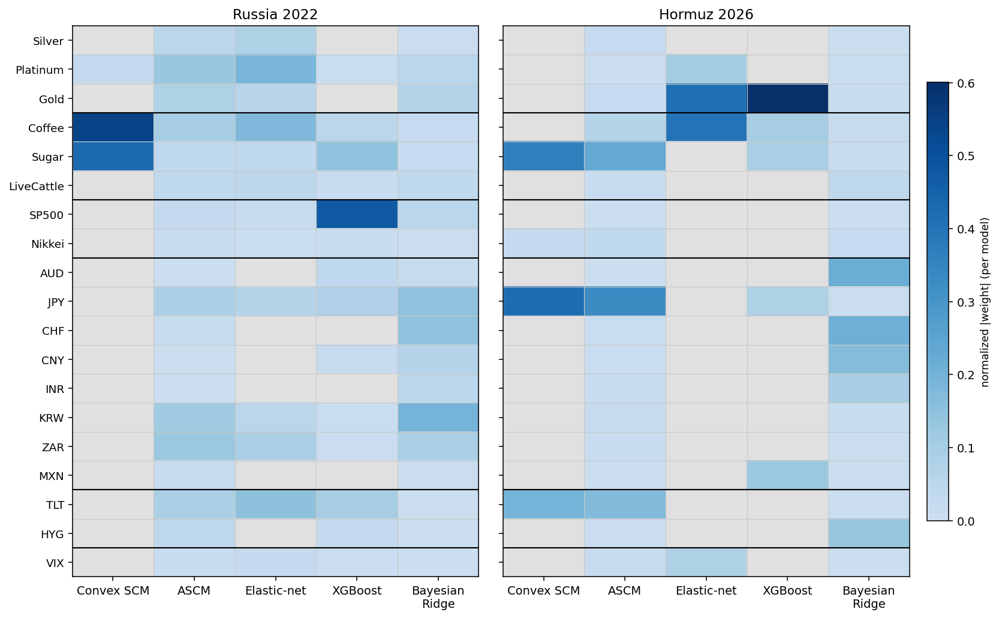

# Donor contribution analysis

Standalone analysis for the planned **Chapter 6 "Donor weights" subsection**. It answers
two questions the headline results raise but do not address:

1. **Which donors does the ensemble actually lean on**, and do the five estimators agree?
2. **How does each donor contribute** — does it carry the counterfactual's *trend*, its
   *variance* (day-to-day co-movement), or does it *diverge in the post-window* because
   it is itself moved by something other than the common factor, which is what makes the
   per-model estimate vary?

Everything here is **descriptive diagnostics**, not causal identification. Nothing in
this file is in the paper yet; it is the worksheet we will distil into the subsection.

Reproduce with `python scripts/donor_contribution_analysis.py` (repo venv). Outputs:
- `docs/figures/donor_importance_heatmap.png` — per-model normalized |weight| heatmap
- `docs/data/donor_contribution_metrics.csv` — the per-donor metric table below

---

## 1. Method

**Pool.** The 19-donor shared/preferred pool, both events, grouped by category
(Metals, Agriculturals, Equities, FX, Rates/credit, Volatility).

**Weights.** Each model exposes a per-donor `weights` series (`lib/models.py`): convex
simplex weights, signed ASCM/elastic-net coefficients, XGBoost gain importances, and
Bayesian-ridge standardized coefficients. To compare across incommensurable scales we
take the **absolute value and normalize to sum to one per model** (the heatmap), and the
**consensus importance** `w_mean` is the mean of that normalized weight across the four
comparable models. **Bayesian ridge is excluded from the consensus** — its "weights" are
standardized coefficients, not selection probabilities (thesis App. B) — but it is shown
in the heatmap for completeness. `w_disp` is the across-model standard deviation of the
normalized weight: a **model-disagreement** measure.

**Contribution diagnostics** (pre-window unless stated):
- `rho_lvl` = corr(log Brent, log donor) over the pre-window → **trend co-movement**.
  High |value| means the donor tracks Brent's slow drift (sign gives direction; many
  donors are *inverse* trackers, e.g. the dollar/safe-haven block).
- `rho_ret` = corr(Δlog Brent, Δlog donor) → **variance co-movement** (does the donor
  track Brent's day-to-day fluctuation, not just its level).
- `post_div` = standardized cumulative **idiosyncratic** post-window move of the donor:
  regress the donor's standardized return on a *leave-one-out common factor* (mean of the
  other 18 donors' standardized returns) over the pre-window, then sum the post-window
  residual and scale by √n. This is **Brent-free** by construction, so it isolates a
  donor moving on its *own* channel after \(T_0\) — the signature of post-treatment
  contamination by another event. |post_div| ≳ 2 is a flag.

**Caveats.** (i) `rho_lvl` is a correlation of non-stationary levels — it measures shared
trend, not a clean regression coefficient; read it qualitatively. (ii) Daily `rho_ret`
values are modest across the board (oil has a large idiosyncratic daily component), so
"variance contribution" is everywhere weaker than "trend contribution" — a finding in
itself. (iii) `post_div` is descriptive: a large value says the donor decoupled from the
pool after \(T_0\), not *why*.

---

## 2. The importance heatmap

*Per-model normalized |weight|, category-grouped; grey = not used (zero weight).*

Reading it:

- **The pool is sparse and the models disagree on who carries the load.** Convex SCM and
  XGBoost concentrate on 2–4 donors; ASCM and elastic-net spread weight across the FX
  block; Bayesian ridge loads FX (CHF/CNY/INR/AUD) that the others largely ignore. This
  disagreement *is* the model-uncertainty band the ensemble reports as the IQR.
- **Russia** leans on softs (Coffee, Sugar) and SP500, with a diffuse FX/rates tail
  (JPY, KRW, ZAR, TLT).
- **Hormuz** leans on **Gold** and **JPY**, plus Sugar and Coffee. Gold is the single
  most important Hormuz donor *and* the one the models disagree on most (see below).

---

## 3. Per-donor metrics

Consensus weight `w_mean`, model disagreement `w_disp`, trend `rho_lvl`, variance
`rho_ret`, post-window idiosyncratic divergence `post_div`. Full file:
`docs/data/donor_contribution_metrics.csv`.

### Russia 2022

| Donor | w_mean | w_disp | rho_lvl | rho_ret | post_div |
|---|---:|---:|---:|---:|---:|
| Coffee | 0.218 | 0.192 | 0.877 | 0.108 | −1.59 |
| Sugar | 0.164 | 0.159 | 0.879 | 0.175 | −0.74 |
| SP500 | 0.131 | 0.199 | 0.934 | 0.283 | −2.74 |
| Platinum | 0.090 | 0.072 | 0.477 | 0.175 | −1.39 |
| TLT | 0.083 | 0.053 | −0.799 | −0.245 | −2.21 |
| JPY | 0.056 | 0.033 | 0.851 | 0.070 | **5.04** |
| ZAR | 0.056 | 0.053 | −0.607 | 0.047 | 1.98 |
| KRW | 0.044 | 0.045 | 0.225 | 0.087 | **3.49** |
| Gold | 0.034 | 0.035 | −0.544 | −0.007 | −1.62 |
| Silver | 0.033 | 0.035 | −0.048 | 0.067 | −1.57 |
| LiveCattle | 0.025 | 0.019 | 0.899 | 0.093 | −0.98 |
| HYG | 0.017 | 0.018 | 0.461 | 0.301 | **−4.22** |
| VIX | 0.012 | 0.010 | −0.560 | −0.275 | 0.20 |
| Nikkei | 0.012 | 0.007 | 0.786 | 0.119 | −0.46 |
| AUD | 0.009 | 0.015 | 0.208 | 0.025 | −1.43 |
| CNY | 0.005 | 0.008 | −0.838 | −0.047 | **6.02** |
| CHF | 0.004 | 0.008 | 0.211 | 0.060 | 1.42 |
| MXN | 0.004 | 0.007 | −0.518 | 0.013 | 0.37 |
| INR | 0.001 | 0.002 | 0.155 | 0.015 | **2.48** |

### Hormuz 2026

| Donor | w_mean | w_disp | rho_lvl | rho_ret | post_div |
|---|---:|---:|---:|---:|---:|
| Gold | 0.259 | **0.257** | −0.757 | 0.141 | **−2.50** |
| JPY | 0.207 | 0.172 | 0.217 | 0.032 | 0.45 |
| Sugar | 0.171 | 0.137 | 0.631 | 0.141 | 0.43 |
| Coffee | 0.141 | 0.154 | −0.703 | 0.008 | −0.62 |
| TLT | 0.091 | 0.092 | 0.478 | −0.198 | −0.69 |
| MXN | 0.033 | 0.054 | 0.212 | −0.016 | −0.07 |
| Platinum | 0.027 | 0.046 | −0.583 | 0.084 | −1.55 |
| VIX | 0.025 | 0.033 | −0.275 | −0.119 | −0.61 |
| Nikkei | 0.014 | 0.015 | −0.461 | 0.026 | 0.66 |
| Silver | 0.006 | 0.010 | −0.561 | 0.120 | −1.27 |
| KRW | 0.005 | 0.009 | −0.386 | 0.114 | 0.77 |
| ZAR | 0.004 | 0.007 | 0.373 | −0.050 | 0.19 |
| CNY | 0.002 | 0.004 | 0.375 | 0.034 | −0.19 |
| HYG | 0.002 | 0.004 | −0.570 | 0.144 | −0.20 |
| INR | 0.003 | 0.005 | −0.653 | 0.063 | **2.09** |
| CHF | 0.003 | 0.005 | 0.716 | 0.036 | 1.06 |
| AUD | 0.001 | 0.001 | 0.059 | 0.017 | 0.06 |
| SP500 | 0.001 | 0.001 | −0.625 | 0.173 | 0.81 |

---

## 4. How donors contribute — the three roles

The metrics sort the pool into the three roles the brief named. The roles are not
exclusive (a donor can carry trend *and* diverge late), and the most consequential
donors do exactly that.

### (a) Trend carriers — set the counterfactual's level path
High |`rho_lvl`| with real weight. These pin where the synthetic sits.
- **Russia:** Coffee, Sugar, SP500 (all `rho_lvl` ≈ 0.88–0.93), JPY (0.85), and TLT as an
  *inverse* trend anchor (−0.80). The post-COVID reflation gave softs, equities and oil a
  shared upward trend, so the convex models can reproduce Brent's 2020–22 climb almost
  entirely from Coffee + Sugar.
- **Hormuz:** Gold (−0.76, inverse) and Sugar (0.63) carry the level, with Coffee (−0.70)
  and CHF (0.72). Brent drifted *down* through 2024–25 while gold and most risk assets
  rose, which is why so many Hormuz trend correlations are **negative**: the synthetic
  tracks Brent's mild decline by loading donors that moved oppositely.

### (b) Variance trackers — follow day-to-day fluctuation
Highest `rho_ret`. Note the ceiling is low (~0.30 Russia, ~0.17 Hormuz): **no donor
tracks Brent's daily noise tightly**, so the synthetic reproduces the *path* far better
than the *wiggle*. The relative leaders:
- **Russia:** HYG (0.30) and SP500 (0.28) — the risk-asset block carries what daily
  co-movement there is; TLT and VIX contribute *inverse* high-frequency signal.
- **Hormuz:** SP500 (0.17), HYG (0.14), Gold (0.14), Sugar (0.14) — even flatter, so the
  Hormuz synthetic is essentially a trend reconstruction with little variance matching.

### (c) Post-window divergers — move on their own after \(T_0\), and drive model variance
Large |`post_div`|: the donor decoupled from the pool's common factor in the post-window,
so the projection that relies on it depends on *which* model weighted it.
- **Russia — the FX block lights up:** CNY (+6.0), JPY (+5.0), KRW (+3.5), INR (+2.5),
  ZAR (+2.0). This is the **delayed-contamination channel** the donor catalog predicts:
  through 2022 India/China became buyers of discounted Russian crude and EM/Asian FX
  repriced on terms-of-trade, so these "clean-at-\(T_0\)" donors acquire a Russia
  component over the post-window. HYG (−4.2), SP500 (−2.7) and TLT (−2.2) diverge the
  other way on the 2022 risk-off/Fed-tightening path. Because the models weight this
  block differently (ASCM/elastic-net/Bayesian-ridge load FX; convex/XGBoost do not),
  the Russia gap is the one that **varies across models** — exactly the headline IQR.
- **Hormuz — Gold is the story:** Gold has the **largest weight (0.259) and the largest
  model disagreement (`w_disp` 0.257)** in the entire pool, and a large negative
  `post_div` (−2.5). It is simultaneously the synthetic's main trend anchor *and* a donor
  surging on its own safe-haven bid in the post-window. Models that lean on Gold
  (XGBoost, elastic-net) get a different counterfactual from those that do not (convex,
  which leans on JPY), which is the principal source of the Hormuz cross-model spread.
  INR (+2.1) shows the same EM-oil-importer channel as in Russia, at smaller weight.

---

## 5. Why this explains the cross-model spread (link to the IQR)

The donors with the **highest `w_disp`** are precisely the high-weight donors that also
**diverge late**: Russia SP500 (0.199), Coffee (0.192), Sugar (0.159); Hormuz Gold
(0.257), JPY (0.172), Coffee (0.154). The ensemble IQR is therefore not random model
noise — it is the models **disagreeing about how much to trust a few influential donors
whose post-window paths are contaminated or idiosyncratic**. This is the empirical
content behind two existing thesis claims: that the median is preferred to the mean
(robust to one model over-loading a diverging donor), and that the Russia full-window
gap is inflated/contaminated while the Hormuz estimate is dominated by one safe-haven
donor's behavior.

---

## 6. What to carry into the paper (Chapter 6 subsection)

Proposed subsection content, in order:
1. The heatmap, with one paragraph on sparsity + model disagreement.
2. A compact version of the role taxonomy (trend / variance / late-diverger), naming the
   2–3 donors per role per event — not the full 19-row table (that can be an appendix).
3. The link to the IQR: name Gold (Hormuz) and the FX block (Russia) as the donors whose
   disagreement drives the band, tying back to the delayed-contamination section and the
   median-over-mean choice.

**Open items / things to flag honestly in the paper:**
- `rho_lvl` is a level correlation on non-stationary series; if a reviewer objects, swap
  for a pre-window regression \(R^2\) or a HP-filtered trend correlation. Decision pending.
- `post_div` is a descriptive idiosyncratic residual, not a test; it agrees with the
  catalog's qualitative delayed-channel audit (INR/CNY/softs for Russia) but should be
  presented as corroboration, not proof.
- Variance correlations are low for *every* donor; we should state plainly that the
  synthetic matches Brent's trend far better than its daily variance, rather than imply
  tight tracking.
