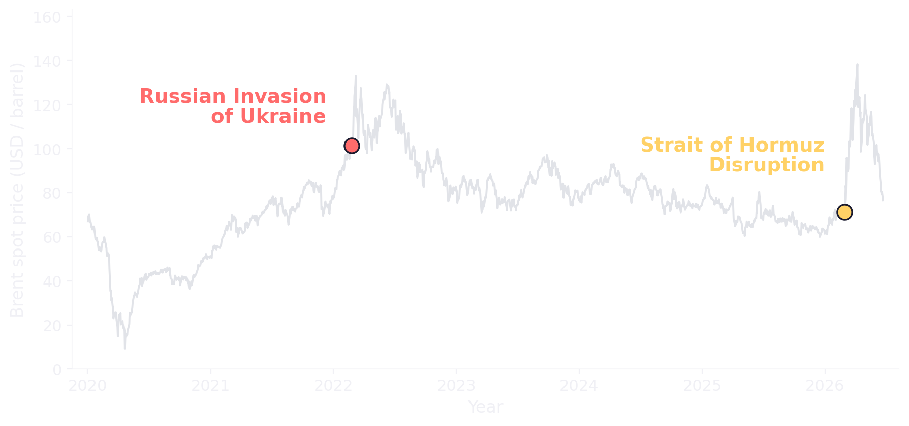
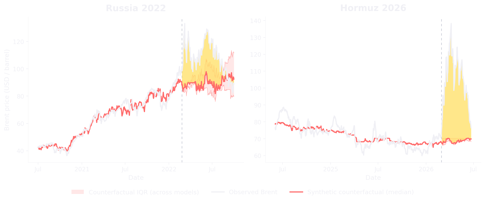
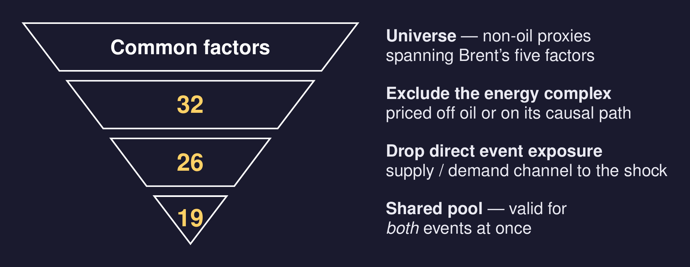
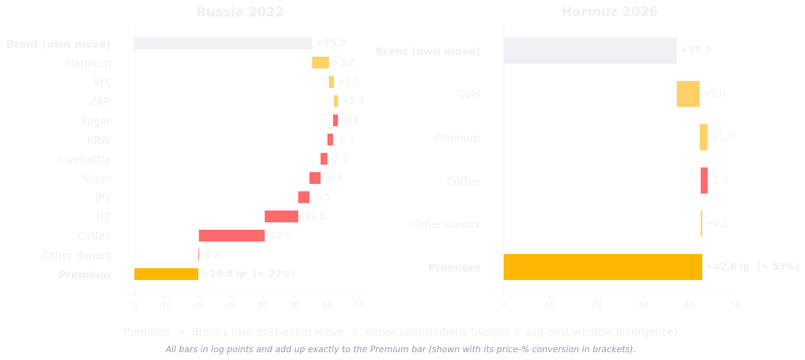
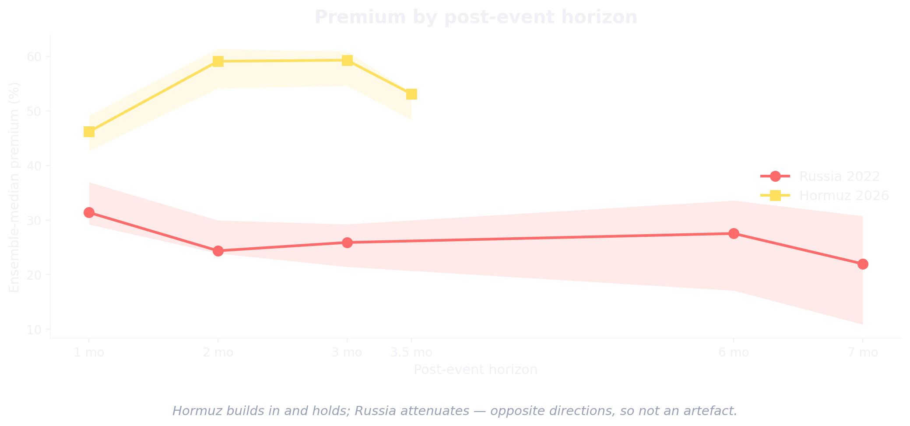
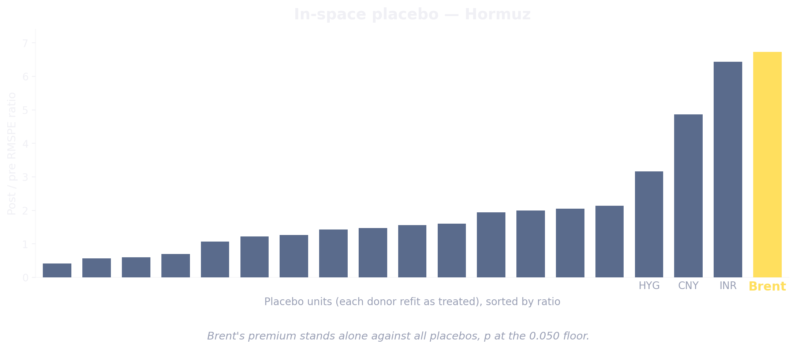
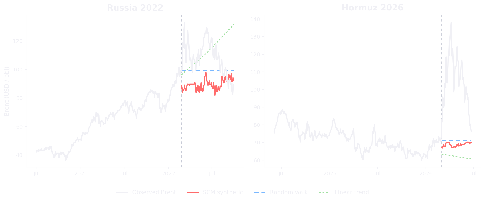

## A parallel worth isolating

{fig-align="center" height="470"}

::: {.fragment style="text-align:center; font-size:0.8em; color:#ffd166; margin-top:0.3em;"}
the **2022 Russian invasion** sets the stage for the **Strait of Hormuz disruption** we price today.
:::

## The causal question {.center background-image="images/Strait_of_Hormuz_satellite_labeled.png" background-size="cover" background-position="center" background-opacity="0.30" background-color="#0d1117"}

::: { style="text-align:center; font-size:1.35em; font-weight:700; color:#ffd166; margin:3em auto 0; line-height:1.3; width:75%;"}
What is the causal effect of the Hormuz disruption on Brent over a policy-relevant post-event window?
:::

## Where this sits and why SCM {.center data-menu-title="Positioning"}

::: {.positioning style="font-size: 0.8em;"}
- [No DiD, no IV.]{style="font-size:1.25em; font-style:italic;"} the usual designs have nothing to lean on.
- [So we build the control.]{style="font-size:1.25em; font-style:italic;"} following synthetic control [(Abadie 2010, 2021)]{style="color:#9aa0b5;"}
- [No direct precedent.]{style="font-size:1.25em; font-style:italic;"} the closest price application [(Becker 2021)]{style="color:#9aa0b5;"} leans on cross-country donors and a regulated market.
- [The institutional route runs the other way.]{style="font-size:1.25em; font-style:italic;"} [(Kiel, OIES, World Bank, IEA)]{style="color:#9aa0b5;"} assume a barrel shortfall and model its price impact forward.
:::

::: {.fragment style="text-align:center; font-size:1.1em; font-weight:700; color:#ffd166; margin:0.6em 0; line-height:1.35;"}
Cross-asset SCM on a daily traded price under a geopolitical shock.
:::

## Data and windows {data-menu-title="Data and windows"}

::: {style="font-size: 0.78em;"}
- **Target:** daily Europe Brent spot (EIA series RBRTEd), USD per barrel, through 22 Jun 2026 — a spot quote, so no futures roll or term-structure mechanics.
:::

::: {style="width: 720px; max-width: 92%; margin: 0.3em auto 0;"}
::: {style="font-size: 0.58em;"}
| Event | Pre-window | Post-window | Pre $n$ / Post $n$ (days) | Post mean (\$/bbl) |
|---|---|---|:---:|:---:|
| Russia 2022 | 2020-07-01 → 24 Feb | to 2022-09-30 | 421 / 151 | 108.5 |
| Hormuz 2026 | 2024-06-01 → 28 Feb | to 2026-06-22 (open) | 443 / 77 | 105.1 |
:::
:::

::: {.fragment style="text-align:center; font-size:0.9em; font-weight:700; color:#ffd166; margin-top:0.4em;"}
Comparable pre-samples, so each synthetic is fit on similar data. 
:::

## Hormuz added roughly half of Brent's price

{fig-align="center" height="410"}

::: {style="font-size: 0.68em; margin-top:0.1em;"}
- Hormuz added a [**≈ 53%**]{style="color:#ffd166;"} premium over its no-event counterfactual (Russia [**≈ 22%**]{style="color:#ffd166;"}).
- **Tight:** the red band is narrow — the models agree.
:::

::: {style="text-align:center; font-size:0.85em; color:#ffd166; margin-top:0.2em;"}
Brent trades roughly half above where the market alone would put it.
:::

## Donor selection *is* identification

::: {style="text-align:center; font-size:0.62em; color:#9aa0b5; margin-bottom:0.1em;"}
**Common factors:** global growth / industrial cycle · US dollar · real rates · risk appetite · China demand
:::

{fig-align="center" height="400"}

::: {.fragment style="text-align:center; font-size: 1.05em; font-weight:700; color:#ffd166;"}
Good donors track Brent normally but sit off the oil shock — so their gap reveals the premium.
:::

## No single model — an ensemble

::: {style="text-align:center; font-size:0.62em; color:#9aa0b5; margin-bottom:0.1em;"}
**Five estimators whose biases bracket the cases.** Headline = cross-model **median**; **IQR** = model-uncertainty band.
:::

::: {.ens-block style="width: 640px; max-width: 90%; margin: 0 auto;"}
::: {style="font-size: 0.6em;"}
| Estimator | Russia 2022 (%) | Hormuz 2026 (%) |
|---|:---:|:---:|
| Convex SCM | 33.6 | 53.1 |
| Augmented SCM | 10.9 | 53.7 |
| Elastic net | 22.0 | 53.4 |
| XGBoost | 30.8 | 48.3 |
| Bayesian ridge | −9.0 | 40.4 |
| **Ensemble median** | **22.0** | **53.1** |
| **IQR** | **[10.9, 30.8]** | **[48.3, 53.4]** |
:::

::: {style="font-size:0.5em; font-style:italic; color:#9aa0b5; margin-top:0.35em;"}
Each value is that estimator's average Brent premium (ATT) over the post-event window, in %. Median and IQR are taken across the five models.
:::
:::

::: {.fragment style="text-align:center; font-size:1.0em; font-weight:700; color:#ffd166; margin-top:0.4em;"}
Hormuz's tighter IQR means the models agree far more than on Russia's volatile pre-period.
:::

## What builds the premium — donor by donor {data-menu-title="What builds the premium"}

::: {style="text-align:center; font-size:0.62em; color:#9aa0b5; margin-bottom:0.1em;"}
Decomposition shown for the **elastic-net** estimator — the ensemble-**median** model.
:::

{fig-align="center" height="420"}

::: {.fragment style="text-align:center; font-size:0.9em; font-weight:700; color:#ffd166; margin-top:0.15em;"}
The donor basket explains away most of Russia's jump but almost none of Hormuz's — same-size shock, opposite verdict.
:::

## Validation Framework: Three Layers of Rigor {data-menu-title="Validation Framework"}

::: {style="text-align:center; font-size:0.65em; color:#9aa0b5; margin-bottom:2.0em;"}
Stress-testing the synthetic counterfactual through fit, time-stability, and donor-cleanliness checks.
:::

::: {style="font-size: 0.72em; line-height: 1.5;"}

  1. Model Fit & Bias-Variance
  <ul style="margin-top: 0.2em; margin-bottom: 0;">
    <li>Evaluating out-of-sample RMSE to ensure causal estimates reflect a **genuine fit** rather than model over-specification or overmodeling.</li>
  </ul>

  2. Horizon Stability
  <ul style="margin-top: 0.2em; margin-bottom: 0;">
    <li>Stress-testing results across various timeframes to confirm the premium is **robust to the window choice** and free from delayed donor contamination.</li>
  </ul>

  3. Contamination & Bias Bounding
  <ul style="margin-top: 0.2em; margin-bottom: 0;">
    <li>Utilizing **placebos and leave-one-out checks** to isolate outlier influence, and evaluating potential contamination to determine if we **over- or underestimate**.</li>
  </ul>

:::

## Models' Bias / Variance Evaluation {data-menu-title="Validation — fit"}

::: {style="text-align:center; font-size:0.6em; color:#9aa0b5; margin-bottom:0.2em;"}
Walk-forward validation. Low **and** close train/val RMSE means a good fit that holds out of sample.
:::

::: {style="width: 760px; max-width: 94%; margin: 0 auto; font-size: 0.56em;"}
| Model | Train RMSE | Val RMSE | Val/Train | Russia Val/Train |
|---|:---:|:---:|:---:|:---:|
| Convex SCM | 0.060 | 0.083 | 1.40 | 1.25 |
| Augmented SCM | 0.049 | 0.075 | 1.54 | 2.06 |
| Elastic net | 0.052 | 0.079 | 1.51 | 1.99 |
| XGBoost | 0.044 | 0.082 | 1.84 | 3.24 |
| Bayesian ridge | 0.034 | 0.078 | 2.28 | 3.09 |
:::

::: {style="text-align:center; font-size:0.5em; font-style:italic; color:#9aa0b5; margin-top:0.3em;"}
RMSE in log units (first three columns Hormuz). Russia's higher ratios track its volatile pre-period.
:::

::: {.fragment style="text-align:center; font-size:0.95em; font-weight:700; color:#ffd166; margin-top:0.3em;"}
Validation errors scale up expectedly but remain well within bounds. The ensemble median optimizes the bias-variance trade-off.
:::

## Is the Estimate Sensitive to Horizons? {data-menu-title="Validation — internal"}

::: {style="text-align:center; font-size:0.6em; color:#9aa0b5; margin-bottom:1.0em;"}
Evaluating median effects and IQRs across varying post-event windows.
:::

:::: {.columns}
::: {.column width="100%"}
{fig-align="center" height="400"}
:::
::::

::: {.fragment style="text-align:center; font-size:0.9em; font-weight:700; color:#ffd166; margin-top:1.0em;"}
The horizon effects diverge by event. The Hormuz premium remains stably high over time.
:::

## Contamination Bias Analysis {data-menu-title="Validation — placebo & bias"}

::: {style="text-align:center; font-size:0.6em; color:#9aa0b5; margin-bottom:0.5em;"}
Refit every donor as if it were the treated unit; leave-one-out and train the model to measure sensitivity on a single variable; measuring the direction of the possible contamination bias.
:::

:::: {.columns}
::: {.column width="62%"}
{fig-align="center" height="420"}
:::

::: {.column width="38%"}
::: {style="font-size:0.50em; margin-top:0.2em; font-family: inherit;"}

::: {.fragment}

Sensitivity: Drop one donor

<table style="width: 100%; border-collapse: collapse; margin-bottom: 1.8em; background: rgba(255,255,255,0.02); border-radius: 4px;">
  <thead>
    <tr style="border-bottom: 2px solid #ffd166; background: rgba(255, 209, 102, 0.08);">
      <th style="padding: 8px 12px; text-align: left; font-weight: 600; color: #fff;">Model / Spec</th>
      <th style="padding: 8px 12px; text-align: center; font-weight: 600; color: #fff; width: 35%;">Hormuz (%)</th>
    </tr>
  </thead>
  <tbody>
    <tr style="border-bottom: 1px solid rgba(255,255,255,0.08);">
      <td style="padding: 7px 12px; color: #9aa0b5;">Convex SCM</td>
      <td style="padding: 7px 12px; text-align: center; font-weight: 600; color: #fff;">48–56</td>
    </tr>
    <tr style="border-bottom: 1px solid rgba(255,255,255,0.08);">
      <td style="padding: 7px 12px; color: #9aa0b5;">Augmented SCM</td>
      <td style="padding: 7px 12px; text-align: center; font-weight: 600; color: #fff;">52–57</td>
    </tr>
    <tr style="border-bottom: 1px solid rgba(255,255,255,0.08);">
      <td style="padding: 7px 12px; color: #9aa0b5;">Elastic net</td>
      <td style="padding: 7px 12px; text-align: center; font-weight: 600; color: #fff;">52–59</td>
    </tr>
    <tr>
      <td style="padding: 7px 12px; color: #9aa0b5;">XGBoost</td>
      <td style="padding: 7px 12px; text-align: center; font-weight: 600; color: #fff;">49–55</td>
    </tr>
  </tbody>
</table>
:::

::: {.fragment}

Bias if contaminated

<table style="width: 100%; border-collapse: collapse; background: rgba(255,255,255,0.02); border-radius: 4px;">
  <thead>
    <tr style="border-bottom: 2px solid #ffd166; background: rgba(255, 209, 102, 0.08);">
      <th style="padding: 8px 12px; text-align: left; font-weight: 600; color: #fff;">Region</th>
      <th style="padding: 8px 12px; text-align: center; font-weight: 600; color: #fff; width: 35%;">Bias</th>
    </tr>
  </thead>
  <tbody>
    <tr style="border-bottom: 1px solid rgba(255,255,255,0.08);">
      <td style="padding: 8px 12px; color: #fff; font-weight: 600;">Hormuz</td>
      <td style="padding: 8px 12px; text-align: center; color: #ff6b6b; font-weight: 600;">−1 to −8%</td>
    </tr>
    <tr>
      <td style="padding: 8px 12px; color: #fff; font-weight: 600;">Russia</td>
      <td style="padding: 8px 12px; text-align: center; color: #4eed94; font-weight: 600;">+13 to +21%</td>
    </tr>
  </tbody>
</table>
:::

:::
:::
::::

::: {.fragment style="text-align:center; font-size:0.9em; font-weight:700; color:#ffd166; margin-top:0.4em;"}
Brent stands alone at the [**0.050**]{style="color:#ffd166;"} floor, the models are robust and not sensitive to a single variable. Any leftover bias on Hormuz is more likely to be [**negative**]{style="color:#ffd166;"}.
:::

## Conclusion {data-menu-title="Conclusion"}

::: {style="font-size: 0.65em; line-height: 1.25;"}

  Headline
  <ul style="margin-top: 0.1em; margin-bottom: 0.2em;">
    <li>Hormuz added a premium of about [**53%**]{style="color:#ffd166;"} over Brent's no-event price. Positive under every estimator, driven by no single donor or model, and if biased at all it is biased downward, so the true effect is likely larger.</li>
  </ul>

::: {.fragment style="margin-bottom: 0.4em;"}
  Contributions
  <ul style="margin-top: 0.1em; margin-bottom: 0.2em;">
    <li>A data-driven premium that [complements]{style="color:#ffd166;"} the institutional scenario estimates rather than competing with them.</li>
    <li>An [auditable template]{style="color:#ffd166;"} for cross-asset SCM under a single-unit geopolitical shock.</li>
  </ul>
:::

::: {.fragment}
  Limits
  <ul style="margin-top: 0.1em; margin-bottom: 0;">
    <li>A reduced-form total effect, not split into supply, risk, and expectations.</li>
    <li>Inference has little power at one treated unit, so the placebo's [0.050]{style="color:#ffd166;"} is the best the test can reach, with Brent still ranking first.</li>
    <li>Validation is internal and regime-bound, our methodology is not directly appliable to the other shocks.</li>
  </ul>
:::

:::
## {background-image="images/title_bg.jpg" background-size="cover" background-position="center" background-opacity="0.45" background-color="#0d1117" data-menu-title="Thank You"}

::: {style="display: flex; flex-direction: column; align-items: center; justify-content: center; height: 100%; text-align: center; margin-top: 15%;"}

[**Thank You!**]{style="font-size: 3.6em; color: white; font-weight: 700; letter-spacing: 0.05em; text-transform: uppercase;"}

[**Q&A**]{style="font-size: 1.8em; color: white; font-weight: 300; letter-spacing: 0.1em; opacity: 0.8;"}

:::

## Appendix — how we sign the contamination bias {data-menu-title="Appendix: contamination bias"}

::: {style="text-align:center; font-size:0.58em; color:#9aa0b5; margin-bottom:0.2em;"}
A naive, directional check. It asks which way any leftover contamination would move the premium, not whether the donors are clean.
:::

::: {style="font-size:0.62em;"}

[The identity]{style="color:#ffd166;"}

- The premium is the gap between Brent and the donor basket, so if a donor is nudged by the event, that nudge leaks into the basket. Writing the event-induced part of donor $j$ as $\delta_j$, the bias in the premium is exactly $-\sum_j w_j\,\delta_j$, the model's weight on each donor times how far that donor was pushed.

[Measuring the push, Brent-free]{style="color:#ffd166;"}

- We cannot see $\delta_j$ directly, so we build each donor a reference from the [**other donors only**]{style="color:#ffd166;"}, never Brent. We fit the donor to that reference before the event, then read how far it drifts from it afterward. That drift is our estimate of $\delta_j$.

[Reading the sign]{style="color:#ffd166;"}

- A donor pushed [**up**]{style="color:#ffd166;"} lifts the basket and shrinks the premium, so the estimate is conservative. A donor pushed [**down**]{style="color:#ffd166;"} sinks the basket and inflates it. We weight each donor's drift by the model's weight and sum, which gives the net direction.

:::

::: {style="text-align:center; font-size:0.5em; font-style:italic; color:#9aa0b5; margin-top:0.25em;"}
Limits: the reference is the rest of the pool, so a shock hitting every donor equally is invisible here, and low-reliability donors add noise. Directional, not a correction.
:::

## Appendix — No-donor baselines and external validation {data-menu-title="Validation — external"}

::: {style="text-align:center; font-size:0.6em; color:#9aa0b5; margin-bottom:0.2em;"}
Checks that use **no donors at all**.
:::

:::: {.columns}
::: {.column width="66%"}
{fig-align="center" height="330"}
:::
::: {.column width="34%"}
::: {style="font-size:0.52em; margin-top:2.2em;"}
| Russia counterfactual | \$/bbl |
|---|:---:|
| SCM synthetic | 88.6 |
| EIA STEO forecast | 84.9 |
| Actual Brent | 108.5 |
:::
:::
::::

::: {.fragment style="text-align:center; font-size:0.9em; font-weight:700; color:#ffd166; margin-top:0.2em;"}
The naive trend even points the wrong way, and on Russia our synthetic lands within [**\$3.6**]{style="color:#ffd166;"} of the EIA's forecast.
:::

## Appendix — the retained 19-donor pool {data-menu-title="Appendix: 19-donor pool"}

::: {style="text-align:center; font-size:0.6em; color:#9aa0b5; margin-bottom:0.3em;"}
The shared pool held fixed across both events. Spans all five common factors with non-oil assets, and excludes the energy complex by design.
:::

::: {style="width: 780px; max-width: 92%; margin: 0 auto;"}
::: {style="font-size: 0.6em;"}
| Category | Donors (shared pool) |
|---|---|
| Metals (3) | Silver, Platinum, Gold |
| Agriculturals (3) | Coffee, Sugar, Live Cattle |
| Equities (2) | S&P 500, Nikkei 225 |
| Foreign exchange (8) | AUD, JPY, CHF, CNY, INR, KRW, ZAR, MXN |
| Rates & credit (2) | TLT (long Treasuries), HYG (high-yield credit) |
| Volatility (1) | VIX (implied S&P 500 volatility) |
:::
:::

## Appendix — empirical confirmation of the audit {data-menu-title="Appendix: empirical confirmation"}

::: {style="text-align:center; font-size:0.6em; color:#9aa0b5; margin-bottom:0.3em;"}
A donor-level battery (Chow-type break tests, Wilcoxon event-window tests, Bai–Perron dating) run **before any model is fit**. The economics and the statistics agree.
:::

::: {style="font-size: 0.68em;"}
- **Hormuz 2026:** [31 of the 32 candidates]{style="color:#ffd166;"} agree with the audit at the cutoff. Only Cotton differs, and its exclusion is an indirect, lagged causal-channel call the contemporaneous tests are not expected to reproduce.
- **Russia 2022:** the tests add a single flag on CNY, attributable to the concurrent China zero-COVID dynamics rather than the war.
- **Only one within-pre-window break** among retained donors, a single VIX break on 2022-01-07, seven weeks before the cutoff. Read as informative, not exclusionary — it does not recur on the analysis window alone, and dropping VIX moves the estimate by [less than one point]{style="color:#ffd166;"}.
:::

## Appendix — donor weights by model and event {data-menu-title="Appendix: donor weights"}

{fig-align="center" height="420"}

::: {style="text-align:center; font-size:0.52em; color:#9aa0b5; margin-top:0.15em;"}
Each cell is a donor's weight in one model, in absolute value and normalised to sum to one within that model. Darker is larger, grey is unused. Rows are the 19-donor pool by category, columns are the five estimators. The full decomposition behind the contribution figure. The Bayesian ridge is shown for completeness but excluded from the consensus weight, its coefficients not being comparable selection weights.
:::

## Appendix — donor audit catalog (1/2) {data-menu-title="Appendix: audit catalog 1"}

::: {style="text-align:center; font-size:0.55em; color:#9aa0b5; margin-bottom:0.2em;"}
All 32 candidates. **C** clean (retained) · **M** mild, secondary/terms-of-trade channel (excluded) · **H** heavy, direct exposure / SUTVA violation (excluded). Metals, agriculturals, equities.
:::

::: {style="width: 900px; max-width: 96%; margin: 0 auto;"}
::: {style="font-size: 0.42em;"}
| Donor | Loads on (with Brent) | RU 2022 | HZ 2026 | In 19 |
|---|---|:---:|:---:|:---:|
| **Metals** | | | | |
| Copper | Global industrial cycle ("Dr Copper") | M | C | |
| Iron Ore | China industrial demand | M | C | |
| Silver | Precious + industrial dual factor | C | C | Yes |
| Platinum | Auto catalysts / South Africa PGM | C | C | Yes |
| Palladium | Auto catalysts (Russia ~40% supply) | H | C | |
| Gold | Real rates / safe-haven premium | C | C | Yes |
| **Agriculturals** | | | | |
| Soybeans | Global trade activity, China demand | M | C | |
| Wheat | Russia+Ukraine ~30% world exports | H | C | |
| Corn | Ukraine ~13% world corn exports | H | C | |
| Coffee | Brazil/Vietnam concentrated, climate | C | C | Yes |
| Sugar | Brazil/India concentrated | C | C | Yes |
| Cotton | Oil→polyester substitution (indirect) | M | M | |
| Live Cattle | North-American livestock cycle | C | C | Yes |
| **Equities** | | | | |
| S&P 500 | US growth / equity risk premium | C | C | Yes |
| Nikkei 225 | Japan growth / safe-haven equity | C | C | Yes |
| EM equities | Broad emerging markets | M | C | |
:::
:::

## Appendix — donor audit catalog (2/2) {data-menu-title="Appendix: audit catalog 2"}

::: {style="text-align:center; font-size:0.55em; color:#9aa0b5; margin-bottom:0.2em;"}
All 32 candidates, continued. **C** clean (retained) · **M** mild (excluded) · **H** heavy, SUTVA violation (excluded). FX, rates & credit, volatility, crypto.
:::

::: {style="width: 900px; max-width: 96%; margin: 0 auto;"}
::: {style="font-size: 0.42em;"}
| Donor | Loads on (with Brent) | RU 2022 | HZ 2026 | In 19 |
|---|---|:---:|:---:|:---:|
| **Foreign exchange** | | | | |
| EUR | Eurozone growth (EU energy crisis) | H | C | |
| GBP | UK growth (UK gas exposure) | M | C | |
| AUD | Australia / China-demand commodity FX | C | C | Yes |
| JPY | Safe-haven FX | C | C | Yes |
| CHF | Safe-haven FX | C | C | Yes |
| CNY | China managed currency | C | C | Yes |
| INR | India growth / EM | C | C | Yes |
| KRW | Korea manufacturing | C | C | Yes |
| ZAR | EM commodities (PGMs, gold) | C | C | Yes |
| MXN | EM / Mexico | C | C | Yes |
| DXY | Trade-weighted dollar (EUR dominant) | H | C | |
| **Rates & credit** | | | | |
| US 10Y | Real risk-free rate / growth | M | C | |
| TLT | Long-duration US Treasuries | C | C | Yes |
| HYG | US high-yield credit / risk premium | C | C | Yes |
| **Volatility** | | | | |
| VIX | Implied S&P 500 volatility (inverse) | C | C | Yes |
| **Crypto** | | | | |
| Bitcoin | Digital risk-asset / liquidity (sanctions Mar 2022) | H | C | |
:::
:::